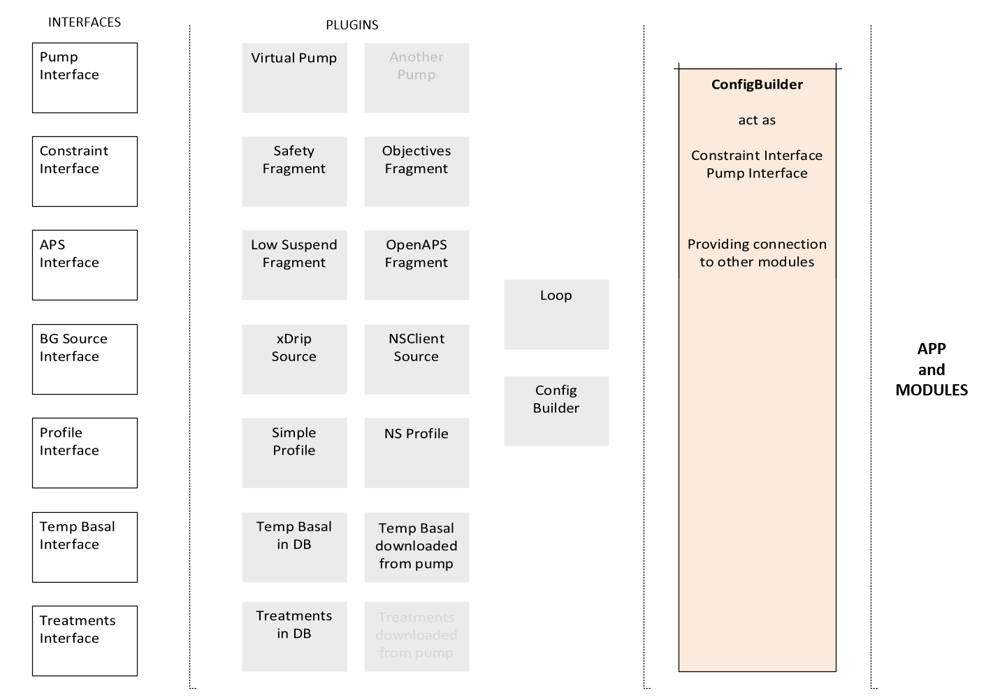

Zum Starten
===========

**Was ist AndroidAPS ?**


Die Ziele, die zur Entstehung führten
--------------------------------------
   
* App mit „modularer Basis“, es soll leicht sein, neue Module hinzuzufügen   
* Eine App, bei der es bei der Erstellung möglich ist zu entscheiden, welche Funktionen die App später hat (Wear Control, NsClient)  
* Eine App, die es ermöglicht, einen Open- oder Closed-Loop-Modus zu wählen  
* Eine App, die die Funktionen eines APS visualisiert (Parameter, Ergebnis und Umsetzung)  
* Die Möglichkeit, andere Algorithmen zu verwenden  
* Eine „Virtuelle Pumpe“, mit der man „herumspielen“ kann, bevor man startet  
* Eine App mit enger Nightscout-Integration  
* Die Möglichkeit zum Hinzufügen/Entfernen von Beschränkungen  
* Eine App, die alles enthält, um mit dem Diabetes klar zu kommen (APS+Nightscout)  


Was man benötigt ?
------------------
 
* Android Smartphone (5.0 oder neuer)  
    * xDrip/xDrip+, oder Glimp, oder 600SeriesAndroidUploader   
    * AndroidAPS  
* Nightscout 0.10.0, oder aktueller    
* Dana R Insulinpumpe (in Zukunft auch die Accu Chek Combo - oder du erstellst einen eigenen Treiber für eine andere Insulinpumpe)  
* Ein CGM (Dexcom G4/G5, Freestyle Libre, Eversense oder Medtronic Guardian)


Sicherheit geht vor
===================

Allgemeines
-----------
  
* AndroidAPS ist nur ein Programm zur Unterstützung deiner Diabetestherapie, nicht um den Diabetes zu vergessen!   
* Vertraue niemals blind auf ein Gerät bei der Anpassung der Dosierung. Kontrolliere die Ergebnisse und verstehe, wie der Algorithmus auf diese kommt.   
* Dein Smartphone, welches die Pumpe kontrolliert, sollte ausschließlich für diese Aufgabe verwendet werden, installiere keine Apps, um die Gefahr von Trojanern zu minimieren.   
* Installiere regelmäßig alle Sicherheitsupdates, damit du vor Angriffen bestmöglich geschützt bist! 
  
SMS Steuerung
------------- 
   
* Wenn du diese Option verwendest, behalte im Hinterkopf, was passieren könnte, falls das Handy, welches zur Fernsteuerung verwendet wird, gestohlen wird. Schütze dieses mit einem sicheren Code.   
* Seit AndroidAPS 1.1 wirst du über wichtige ferngesteuerte Aktionen (z.B. Bolus, Profiländerung) eine SMS erhalten. Deswegen solltest du mindestens 2 Telefonnummern hinzufügen (für den Fall, dass ein Handy gestohlen wird).   

Screenshots
===========


  


Architektur - Implementierung von Sicherheit
============================================

Die App ist mit Plugins erstellt.
Jedes Plugin muss ein `extends` Fragment und ein `implements` als PluginBase und kann `implements` Schnittstellen enthalten. 

Eine Deklaration sieht so aus:


`public class ConfigBuilderFragment extends Fragment implements PluginBase, PumpInterface, ConstraintsInterface`

Jedes Plugin muss gekapselt als eigenständiger Programmcode programmiert sein. 

Die einzige Editierung für die Integration ist dann nur in der `MainActivity` class notwendig und sieht in etwa so aus:


`pluginsList.add(SourceXdripFragment.newInstance());`

Wenn es notwendig ist, das das Plugin mit anderen kooperiert muss es immer durch die `ConfigBuilder` class abgebildet werden. Zum Beispiel, um ein Kommando zur Pumpe zu senden:

```
PumpInterface pump = MainApp.getConfigBuilder().getActivePump();
PumpEnactResult result = pump.deliverTreatment(insulin, carbs);
```



`ConfigBuilder` an sich agiert als `PumpInterface` und `ConstraintInterface`. Wenn Sie `MainApp.getConfigBuilder().getActivePump()` aufrufen, gibt `ConfigBuilder` den eigenen Wert zurück. 
Wenn Sie dann mit der Pumpe interagieren, überprüft `ConfigBuilder` zuerst Abhängigkeiten und leitet anschließend den Befehl zum Pumpen Treiber weiter.

Dieses erlaubt spezielle Abhängigkeiten hinzuzufügen, ohne den Rest des Programmcodes anpassen zu müssen. Zum Beispiel, um ein `Fragment' zu erstellen und registrieren:

```
public class BolusConstraint extends Fragment implements PluginBase, ConstraintsInterface {
    @Override
    public boolean isLoopEnabled() {
        return true; // Always enable, limit only things you want
    }

    @Override
    public boolean isClosedModeEnabled() {
        return true; // Always enable, limit only things you want
    }

    @Override
    public boolean isAutosensModeEnabled() {
        return true; // Always enable, limit only things you want
    }

    @Override
    public boolean isAMAModeEnabled() {
        return true; // Always enable, limit only things you want
    }

    @Override
    public APSResult applyBasalConstraints(APSResult request) {
        return request; // Don't change, limit only things you want
    }

    @Override
    public Double applyBasalConstraints(Double absoluteRate) {
        return absoluteRate; // Don't change, limit only things you want
    }

    @Override
    public Integer applyBasalConstraints(Integer percentRate) {
        return percentRate; // Don't change, limit only things you want
    }

    @Override
    public Double applyBolusConstraints(Double insulin) {
        if (insulin > 2d) insulin = 2d;
        return insulin;
    }

    @Override
    public Integer applyCarbsConstraints(Integer carbs) {
        return carbs; // Don't change, limit only things you want
    }

    @Override
    public Double applyMaxIOBConstraints(Double maxIob) {
        return maxIob; // Don't change, limit only things you want
    }

    @Override
    public int getType() {
        return PluginBase.CONSTRAINTS;
    }

    @Override
    public String getName() {
        return "Bolus Constraint";
    }

    @Override
    public boolean isEnabled() {
        return true; // Always enabled and cannot be disabled
    }

    @Override
    public boolean isVisibleInTabs() {
        return false; // No need to have own tab in GUI
    }

    @Override
    public boolean canBeHidden() {
        return true;
    }

    @Override
    public void setFragmentEnabled(boolean fragmentEnabled) {
        // Do nothing, always enabled
    }

    @Override
    public void setFragmentVisible(boolean fragmentVisible) {
        // Do nothing, always hidden
    }
}
```

Wir limittieren den Maximal Bolus auf 2U innerhalb der gesamten App.

`ConfigBuilder` geht immer durch alle registrierten `ConstraintInterfaces` und wählt den restriktivsten Wert aus, bevor der Befehl an den ausgewählten Pumpen Treiber weitergegeben wird.

Der ausgewählte Pumpen Treiber kann selbst auch `ConstraintInterfaces` implementieren, Maximalwerte der Pumpe laden , um diese als weitere Abhängigkeit bereitzustellen.

Die GUI erlaubt dann keine Eingabe von höheren Bolus Werten als Beispiel. 

Glossar
=======

Für das meiste "Looper Vokabular" gehe zu: https://openaps.readthedocs.io/en/latest/docs/Resources/glossary.html

Einige AndroidAPS spezifische Bezeichnungen:

* [Circadian Percentage Profil_de](http://androidaps-user-guide.readthedocs.io/en/latest/de/de_Benutzung.html#circadian-percentage-profil) - ändert dein Basisprofil anhand der eingestellten Zeit oder prozentual.
* Dev (im Homescreen) - Deviation, zeigt an um wie viel Einheiten sich der tatsächliche Anstieg/Senkung des BZ, gegenüber des vorhergesagten Wertes (durch OpenAPS und eingegebener Daten) unterscheidet.