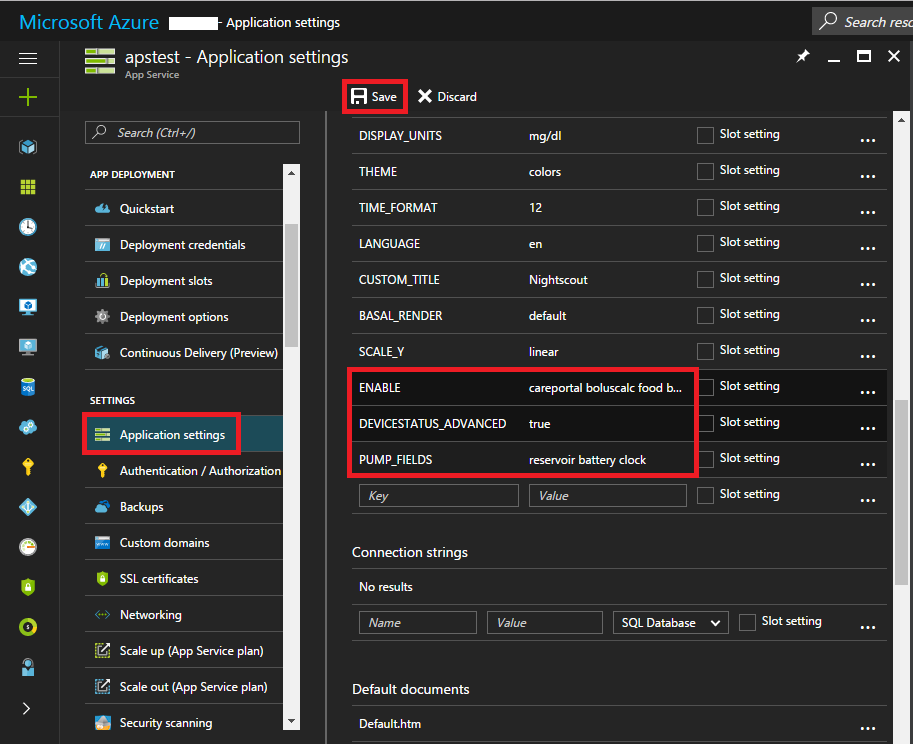

CGM BG Source
=============

For users of Dexcom
-------------------
_If using xdrip…._ 
* If not already set up then download [xDrip](https://github.com/NightscoutFoundation/xDrip) and follow instructions on Nightscout [G4 without share](http://www.nightscout.info/wiki/welcome/nightscout-with-xdrip-wireless-bridge) , [G4 share](http://www.nightscout.info/wiki/welcome/nightscout-with-xdrip-and-dexcom-share-wireless), [G5](http://www.nightscout.info/wiki/welcome/nightscout-with-xdrip-and-dexcom-share-wireless/xdrip-with-g5-support)).
* In xdrip go to Settings > Interapp Compatibility > Broadcast Data Locally and select ON.
* In xdrip go to Settings > Interapp Compatibility > Accept Treatments and select OFF.
* If you want to be able to use AndroidAPS to calibrate then in xdrip go to Settings > Interapp Compatibility > Accept Calibrations and select ON.  You may also want to review the options in Settings > Less Common Settings > Advanced Calibration Settings.
* Select xdrip in ConfigBuilder (setting in AndroidAPS).

_If using OTG cable ('traditional' Nightscout)…._ 
* If not already set up then download Nightscout Uploader app from the Play Store and follow instructions on [Nightscout](http://www.nightscout.info/wiki/welcome/basic-requirements).
* In AndroidAPS Preferences enter your nightscout website and API secret.
* Select NSClient in ConfigBuilder (setting in AndroidAPS).

For users of Libre
------------------

_If using xdrip..._ 
* If not already set up then download xdrip and follow instructions on [LimiTTEer](https://github.com/JoernL/LimiTTer),  [Libre Alarm](https://github.com/pimpimmi/LibreAlarm/wiki) or [BlueReader](https://unendlichkeit.net/wordpress/?p=680&lang=en)([Hardware](https://bluetoolz.de/wordpress/)).
* In xdrip go to Settings > Interapp Compatibility > Broadcast Data Locally and select ON.
* In xdrip go to Settings > Interapp Compatibility > Accept Treatments and select OFF.
* If you want to be able to use AndroidAPS to calibrate then in xdrip go to Settings > Interapp Compatibility > Accept Calibrations and select ON.  You may also want to review the options in Settings > Less Common Settings > Advanced Calibration Settings.
* Select xdrip in ConfigBuilder (setting in AndroidAPS).

_If using Glimp..._ 
* If not already set up then download Glimp and follow instructions on [nightscout](http://www.nightscout.info/wiki/welcome/nightscout-for-libre).
* Select Glimp in ConfigBuilder (setting in AndroidAPS).

For users of MM640g or MM630g
------------------------------
* If not already set up then download [600SeriesAndroidUploaer](http://pazaan.github.io/600SeriesAndroidUploader/) and follow instructions on [nightscout](http://www.nightscout.info/wiki/welcome/nightscout-and-medtronic-640g).
* In 600 Series Uploader go to Settings > Send to xdrip+ and select ON (tick).
* Select MM640g in ConfigBuilder (setting in AndroidAPS).

For users of other CGM uploaded to nightscout
----------------------------------------------
If you have any other CGM set up that sends your data to [Nightscout](http://www.nightscout.info) then 
* In AndroidAPS Preferences enter your nightscout website and API secret.
* Select NSClient in ConfigBuilder (setting in AndroidAPS).

Nightscout
==========

It is assumed you already have a Nightscout site, if not visit the [Nightscout](http://www.nightscout.info/wiki/welcome/set-up-nightscout-using-heroku) page for full instructions on set up, the instructions below are then settings you will also need to add to your Nightscout site.

* Go to https://portal.azure.com/ or https://herokuapp.com/

* Click your App Service name.

* Click Application settings (azure) or Settings > "Reveal Config Variables (heroku)

* Add or edit the variables as follows:
  * `ENABLE` = `careportal boluscalc food bwp cage sage iage iob cob basal ar2 rawbg pushover bgi pump openaps`
  * `DEVICESTATUS_ADVANCED` = `true`
  * `PUMP_FIELDS` = `reservoir battery clock`
  * Various alarms can be set for [monitoring the pump](https://github.com/nightscout/cgm-remote-monitor#pump-pump-monitoring), battery % in particular is encouraged:
    * `PUMP_WARN_BATT_P` = `51`
    * `PUMP_URGENT_BATT_P` = `26`

Dana-R insulin pump
===================

* Go to Main Menu - Setting - User Option 
* Turn on "8. Extended Bolus

* Go to Main Menu > Setting > Discovery

* In phone settings go to Bluetooth, scan for nearby devices, select your DanaR serial number and input your password (Default password is either 1234 or 0000). If DanaR is not showing in scan then restart phone and take DanaR battery out, replace and start these two steps again.

* In AndroidAPS go to Config Builder and select the type of DanaR you have (DanaR, DanaR Korean, DanaRv2, DanaRS)

* Select Menu by tapping the 3 dots in the top right. Select Preferences.

* Select DanaR Bluetooth device, and click your DanaR serial number.

* Select Pump password, and input your password. (Default password is either 1234 or 0000)

* If you want AndroidAPS to allow basal rate above 200%, enable Use extended boluses for >200%. Note this means you cannot loop with high TBRs whilst using extended boluses for food.

* Set basal step on pump to 0.01 U/h

Preferences
===========

Password for settings
---------------------
This allows you to set a password in order to prevent accidental or unauthorised changes to Preferences. After you enter a password here you will be required to enter it in order to access Preferences.  To remove the password option then when within the Preferences delete the text within this field.

Patient age
-----------
Algorithms are different based on patient age so select Child, Teenage or Adult here.

General
-------
* Select your language here.  If your language is not available, or not all of the words translated then feel free to make some suggestions.  The translation files are found here: [App >
 Src > Main > Res > Values > Strings](https://github.com/MilosKozak/AndroidAPS/blob/dev/app/src/main/res/values/strings.xml) or ask in the [gitter chatroom](https://gitter.im/MilosKozak/AndroidAPS).
* Quick Wizard settings allows you to add a quick button for a frequent snack or meal, enter your decided carb details and on the homescreen if you select the quick wizard button it will calculate and bolus for those carbs based on your current ratios (not taking into account blood glucose value or insulin on board though).

Careportal
----------
'Entered by' is the text displayed in your nightscout careportal 'entered by' field.  Set this to something meaningful to you, whether it is the app name, the persons name or the phone name (for example if you are using AndroidAPS as NS Client on a phone that is not the patients phone you may wish to distinguish between phone owners here).

Treatments safety
-----------------
* Max allowed bolus [U]
This is the maximum amount of bolus insulin that AAPS is allowed to deliver. This setting exists as a safety limit to prevent the delivery of a massive bolus due to accidental input or user error. It is recommended to set this to a sensible amount that corresponds roughly to the maximum amount of bolus insulin that you are ever likely to need for a meal or correction dose. This restriction is also applied to the results of the Bolus Calculator.

Loop
----
You can toggle between open and closed looping here.  Open looping means TBR suggestions are made based on your data and appear as a notification but you must manually choose to accept them and manually enter them into your pump.  Closed looping means TBR suggestions are automatically sent to your pump without confirmation or input from you.  The homescreen will display in the top left corner whether you are open or closed looping, and pressing and holding this homescreen button will also allow you to toggle between the two.

Profile
-------
Selecting 'Sync profile to pump' will send your current AndroidAPS profile to the pump as basal profile 1 which means than should AndroidAPS stop working or loose connection with the pump then your pump will revert to the same profile as default rather than you having to manually enter it into the pump.  For more information on profiles see [Working with Profiles in 1.5](http://androidaps-user-guide.readthedocs.io/en/latest/en/en_Usage.html#working-with-profiles-1-5)

Pump settings
-------------
The options here will vary depending on which pump driver you have selected in 'Config Builder'.  Pair and set your pump up according to the [DanaR Insulin Pump](http://androidaps-user-guide.readthedocs.io/en/latest/en/en_Configuration.html#dana-r-insulin-pump) instructions where relevent.

NS Client
---------
* Set your 'nightscout URL' here (https://yourwebsitename.herokuapp.com or https://yourwebsitename.azurewebsites.net), and the 'API secret' (a 12 character password recorded in your heroku or azure variables).  This enables data to be read and written between both the nightscout website and AndroidAPS.  Double check for typos here if you are stuck in Objective 1.
* 'Log app start to nightscout' will record a note in your careportal entries every time the app is started.  The app should not be needing to start more than once a day, more frequently than this suggests a problem.  
* 'Enable local broadcasts' will share your careportal data to other apps on the phone such as xdrip.  
* 'Alarm options' allows you to select which default nightscout alarms to use through the app, to set the alarm values amend your [heroku or azure variables](http://www.nightscout.info/wiki/welcome/website-features#customalarms).

SMS Communicator
----------------
This setting allows remote control of the app by texting instructions to the patients phone which the app will follow such as suspending loop, or bolusing.  Further information is described in [SMS Commands](http://androidaps-user-guide.readthedocs.io/en/latest/en/en_Usage.html#sms-commands).

Other
-----
* You can set defaults for your temp targets here, for more information see [Open APS features](http://androidaps-user-guide.readthedocs.io/en/latest/en/en_Usage.html#open-aps-features).  
* You can set default prime amounts - this will prime the pump the value specified and this insulin is counted as used from the reservoir but not counted in IOB calculations. See the instruction booklet in your cannula box for how many units should be primed depending on needle length and tubing length.
* You can change the display on the homescreen and watch for the values that are in range.  Note that this is just how the graphs look and doesn't impact on your target or calculations.
* 'Shorten tab titles' allows you to see more tab titles on screen, for example the 'Open APS' tab becomes 'OAPS', 'Objectives' becomes 'Obj' etc.

Advanced Settings <> requires more work
---------------------------------------
* OpenAPS MA
  * Always use short average delta instead of...
Enabling this setting is useful when you are using data from unfiltered sources such as xDrip+, as opposed to filtered sources such as an official Dexcom Receiver. Filtered data appears to be smooth, whereas unfiltered data can appear to be jumpy. This unfiltered data could cause AndroidAPS to apply Temporary Basal Rate changes more frequently than are really needed, as the OpenAPS algorithm reacts to the jumpy data. With this setting enabled, the OpenAPS algorithm will use the Short Average Delta (the average change in blood glucose over the past 15 minutes) instead of the last blood glucose reading received. This effectively has a "smoothing" effect on the data and attempts to compensate for any jumpy readings.

Users of Abbot Freestyle Libre sensors collecting their glucose data via devices such as LimiTTers may find this setting provides better results with AAPS.

AAPS works best when the blood glucose data it receives is smooth and consistent. When using xDrip+ as your data source there are a couple of things you can do to help reduce noise in the data.

Users of Abbot Freestyle Libre sensors collecting their blood glucose data via devices such as LimiTTers may find these settings help provide better results with AAPS.

**Smooth Sensor Noise.** In xDrip+ Settings > xDrip+ Display Settings ensure that Smooth Sensor Noise is turned on. This attempts to apply smoothing to noisy data.

**Smooth Sensor Noise (Ultrasensitive).** If you are still seeing noisy data in xDrip+ you can apply more aggressive smoothing using the Smooth Sensor Noise (Ultrasensitive) setting. This will attempt to apply smoothing even on very low levels of detected noise.  

Enabling Engineering Mode in xDrip+ activates extended and experimental features within the app.

To enable Engineering Mode, on the xDrip+ home screen tap the Treatment icon on the right side of the screen (this resembles a syringe). Then tap and hold the microphone icon on the bottom-right of the Treatment interface. In the text field that opens, type "enable engineering mode" and click Done. Engineering Mode is now enabled.

Then navigate to Settings > xDrip+ Display Settings and turn on Smooth Sensor Noise (Ultrasensitive).

Watchfaces
==========

AndroidAPS is designed to be _controlled_ by Android Wear watches.  To achieve this you needed to select the build variant "fullWearcontrolRelease" when [building the APK](http://androidaps-user-guide.readthedocs.io/en/latest/en/en_Installation.html#Building-APK).  Within AndroidAPS, in the ConfigBuilder you need to enable Wear.  There are several watchfaces to choose from that include average delta, IOB, currently active temp basal rate and basal profiles + CGM readings graph.  You can also use the AAPS app on the watch to set a temporary target, administer a bolus, use the bolus wizard, prime/fill, and check the status of loop and pump.  Ensure notifications from AndroidAPS are not blocked on the watch. Confirmation of action (e.g. bolus, tempt target) comes via notification which you will need to swipe and tick.

If you are using another looping system and want to _view_ your looping detail on an AndroidWear watch, or want to watch your child's looping, then you can build just the watch APK.  To do this follow the [build APK instructions](http://androidaps-user-guide.readthedocs.io/en/latest/en/en_Installation.html#Building-APK)) selecting the build variant "nsclientWearRelease".  There are several watchfaces to choose from that include average delta, IOB, currently active temp basal rate and basal profiles + CGM readings graph.

Pebble users can use the [Urchin watchface](https://github.com/mddub/urchin-cgm) to _view_ looping data (if uploaded to nightscout),
but you will not be able to interact with AndroidAPS through the watch.  
You can choose fields to display such as IOB and currently active temp basal rate and predictions. 
If open looping you can use [IFTTT](https://ifttt.com/) to create an applet that says if Notification received from AndroidAPS then send either SMS or pushover notification.

