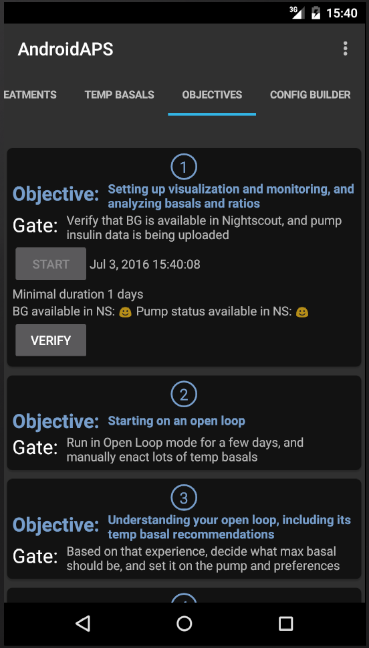

Getting Started
===============

**What is AndroidAPS ?**


Primary goals that made this app to be born
-------------------------------------------

* modular app where is possible to easy add new modules without touching the rest of code
* app that allow localization
* app where we can easy select what will be included in final apk just by easy change and compilation
* app which support open and closed APS mode
* app where you can see how APS works: input params, result and final decision
* allow to add more APS algorithms and let user decide what to use
* app independent to pump driver and containing "Virtual pump" to allow users safely play with APS
* app with tight Nightscout integration
* app where is possible easy to add/remove constraints for user safety
* all-in-one app you need for managing T1D with APS and Nightscout

What you need to get started
----------------------------

* [Android Smartphone](https://docs.google.com/spreadsheets/d/1gZAsN6f0gv6tkgy9EBsYl0BQNhna0RDqA9QGycAqCQc/edit?usp=sharing) (5.0 or later, please follow the link to record how well your phone works in the spreadsheet)
* [xDrip](http://stephenblackwasalreadytaken.github.io/xDrip/)/[xDrip+](https://github.com/jamorham/xDrip-plus) or [Glimp](http://www.nightscout.info/wiki/welcome/nightscout-for-libre) or [600SeriesAndroidUploader](https://github.com/pazaan/600SeriesAndroidUploader)
* [AndroidAPS](https://github.com/MilosKozak/AndroidAPS)
* [Nightscout](https://github.com/nightscout/cgm-remote-monitor) 0.10.0 or later
* Dana-R or Dana-RS Insulin Pump (unless you build your own driver for other insulin pump)
* Continuous Glucose Monitor (CGM) data source
* Dexcom G4/G5 or Freestyle Libre or Eversense or Medtronic Guardian

**When you decide to build your own closed loop always think about security and impact of all your actions**

Safety first
============

General
-------

* AndroidAPS is a just a tool to help you manage diabetes. Not something you can install and forget!
* Don't absolutely trust any device taking control of insulin delivery. Watch it all the time, learn how it works and learn how to predict it's actions.
* Remember the phone paired with pump can do anything with the pump. Dedicate this phone for APS and communication with your child. Do not allow to install other apps and games (!!!) to prevent installing together some unwanted code like trojans, viruses or bots.
* Install all security updates provided by phone manufacter and Google.

SMS Communicator
----------------

* If you enable SMS Communicator, consider what could happen when the phone enabled for remote commands is stolen! So always protect it at least by PIN code
* Since AndoridAPS 1.1 you will receive SMS notification of important remote actions like bolus or profile change. 
  Setup at least 2 numbers for SMS communication to be notified about actions of second phone (for case it's stolen)
  

Screenshots
===========





Architecture - Security Implementation
======================================

Application is built from plugins.
Every plugin must `extends` Fragment and must `implements` PluginBase and may `implements` Interfaces. 
So declaration looks like:

`public class ConfigBuilderFragment extends Fragment implements PluginBase, PumpInterface, ConstraintsInterface`

Every plugin must be designed as standalone code. The only edit needed for integration with the rest of app is in `MainActivity` class and looks like 

`pluginsList.add(SourceXdripFragment.newInstance());`

When plugin needs to cooperate with other plugins it always has to go through `ConfigBuilder` class. For example to send command to pump:
```
PumpInterface pump = MainApp.getConfigBuilder().getActivePump();
PumpEnactResult result = pump.deliverTreatment(insulin, carbs);
```


`ConfigBuilder` itself acts as `PumpInterface` and `ConstraintInterface`. So when you call `MainApp.getConfigBuilder().getActivePump()` `ConfigBuilder` return itself. Then when you interact with pump `ConfigBuilder` verifies constraints first and then pass command to selected pump driver.

This allows to add specific constraints to app without touching the rest of code. For example creating and registering this Fragment:
```
public class BolusConstraint extends Fragment implements PluginBase, ConstraintsInterface {
    @Override
    public boolean isLoopEnabled() {
        return true; // Always enable, limit only things you want
    }

    @Override
    public boolean isClosedModeEnabled() {
        return true; // Always enable, limit only things you want
    }

    @Override
    public boolean isAutosensModeEnabled() {
        return true; // Always enable, limit only things you want
    }

    @Override
    public boolean isAMAModeEnabled() {
        return true; // Always enable, limit only things you want
    }

    @Override
    public APSResult applyBasalConstraints(APSResult request) {
        return request; // Don't change, limit only things you want
    }

    @Override
    public Double applyBasalConstraints(Double absoluteRate) {
        return absoluteRate; // Don't change, limit only things you want
    }

    @Override
    public Integer applyBasalConstraints(Integer percentRate) {
        return percentRate; // Don't change, limit only things you want
    }

    @Override
    public Double applyBolusConstraints(Double insulin) {
        if (insulin > 2d) insulin = 2d;
        return insulin;
    }

    @Override
    public Integer applyCarbsConstraints(Integer carbs) {
        return carbs; // Don't change, limit only things you want
    }

    @Override
    public Double applyMaxIOBConstraints(Double maxIob) {
        return maxIob; // Don't change, limit only things you want
    }

    @Override
    public int getType() {
        return PluginBase.CONSTRAINTS;
    }

    @Override
    public String getName() {
        return "Bolus Constraint";
    }

    @Override
    public boolean isEnabled() {
        return true; // Always enabled and cannot be disabled
    }

    @Override
    public boolean isVisibleInTabs() {
        return false; // No need to have own tab in GUI
    }

    @Override
    public boolean canBeHidden() {
        return true;
    }

    @Override
    public void setFragmentEnabled(boolean fragmentEnabled) {
        // Do nothing, always enabled
    }

    @Override
    public void setFragmentVisible(boolean fragmentVisible) {
        // Do nothing, always hidden
    }
}
```
we limit maximal bolus to 2U everywhere in app.

`ConfigBuilder` always goes through all registered ConstraintInterfaces and select most restrictive value before passing command to selected pump driver.

Added pump driver can implement ConstraintInterface too, load max values from pump and provide it as another constraint. 
GUI then doesn't allow entering higher bolus for example

Glossary
========

For most looping terms see here: https://openaps.readthedocs.io/en/latest/docs/Resources/glossary.html

Some AndroidAPS specific terms include:

[Circadian Percentage Profile](http://androidaps-user-guide.readthedocs.io/en/latest/en/en_Usage.html#circadian-percentage-profile) - changes your base profile based on either a timeshift or a percentage.